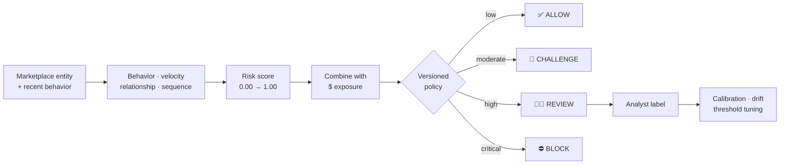
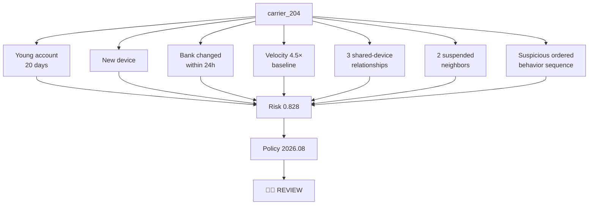
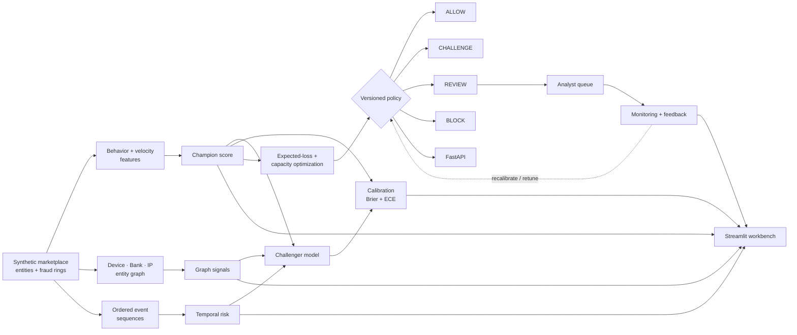
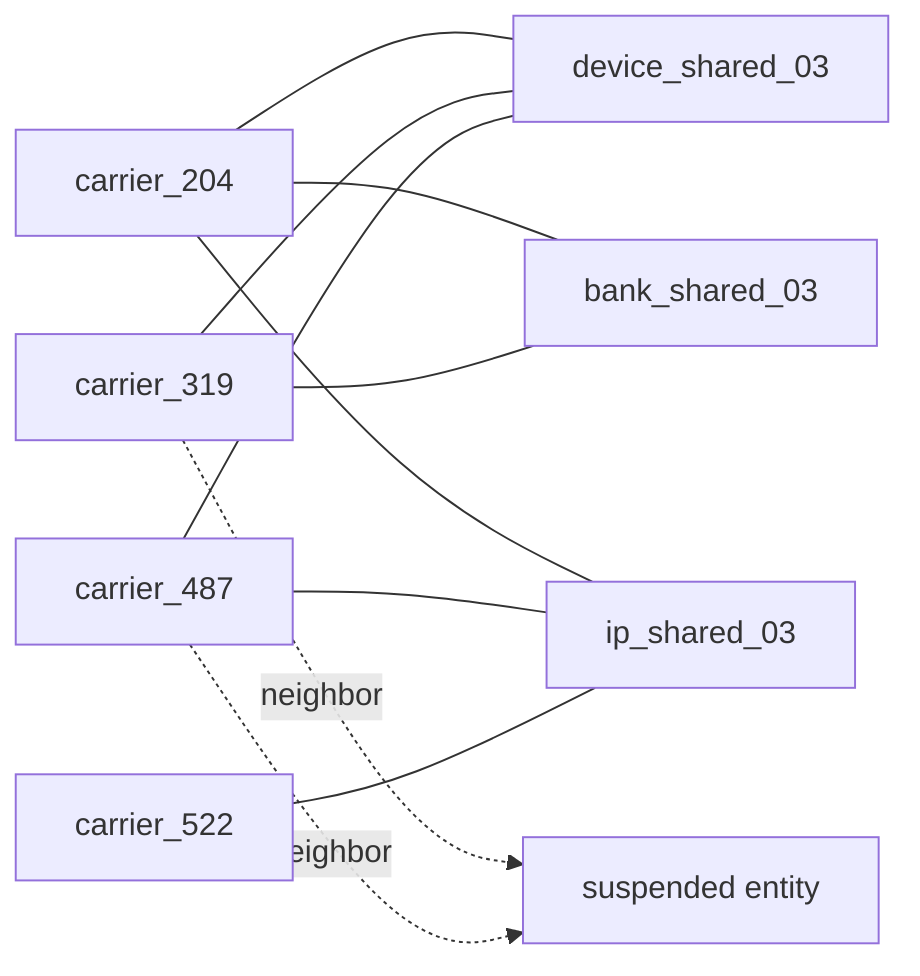
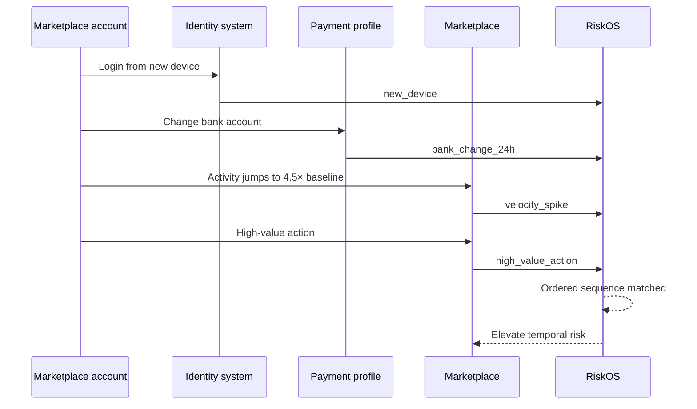
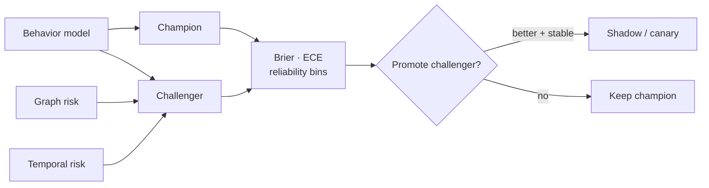
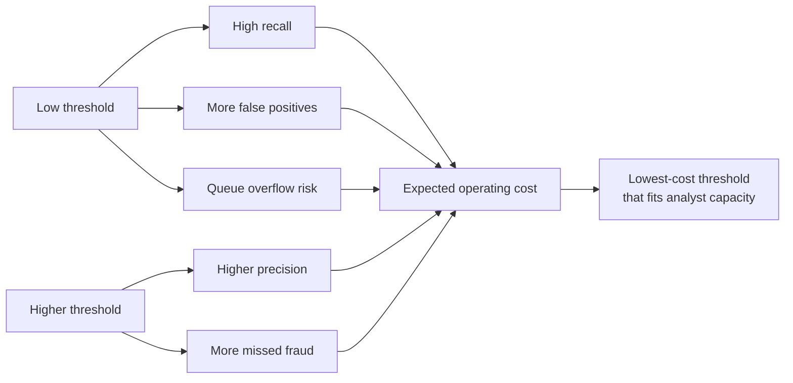
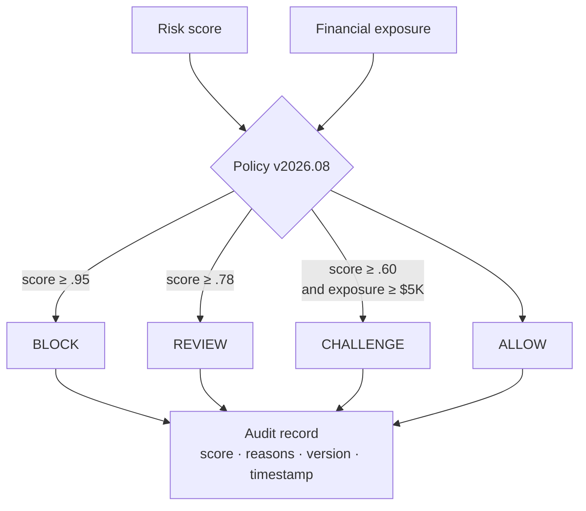
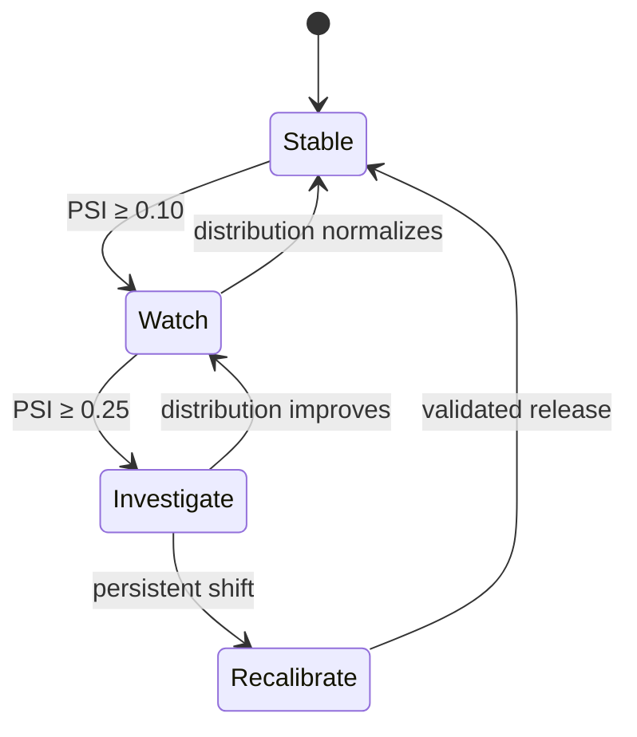

<div align="center">

# 🛡️ RiskOS

### Real-Time Trust & Safety Decisioning Platform

[](https://www.python.org/)
[](https://github.com/VinayK88/riskos/actions/workflows/ci.yml)
[](api/app.py)
[](dashboard/app.py)
[](Dockerfile)
[](#safety-and-scope)

**Simulate → link → sequence → score → calibrate → decide → monitor → learn**

</div>

---

RiskOS is a reproducible marketplace trust-and-safety decisioning platform built around a harder production question than **“is this fraud?”**:

> **Given uncertain model scores, entity relationships, ordered behavior, financial exposure, customer-friction cost, and finite analyst capacity, which entities should be allowed, challenged, reviewed, or blocked?**

The repository demonstrates the full loop: synthetic marketplace generation, behavioral scoring, label-free entity-link graph analysis, temporal sequence detection, champion/challenger experimentation, calibration diagnostics, expected-loss prioritization, capacity-aware threshold optimization, versioned policy decisions, drift monitoring, an analyst dashboard, an API boundary, Docker packaging, tests, and CI.

## 60-second visual tour



A single API request produces an explainable score and an auditable policy decision:

```text
INPUT
carrier_204 + young account + new device + bank change + velocity spike
        │
        ▼
BEHAVIOR RISK     0.890
GRAPH-FEATURE     0.794
OVERALL RISK      0.828
EXPOSURE          $30,000
        │
        ▼
DECISION          REVIEW
POLICY VERSION    2026.08
REASON CODES      6
```

## API input → output example

### Example 1 — suspicious marketplace entity

`POST /score`

```json
{
  "entity_id": "carrier_204",
  "account_age_days": 20,
  "new_device": 1,
  "bank_change_24h": 1,
  "velocity_ratio": 4.5,
  "shared_device_count": 3,
  "suspended_neighbor_count": 2,
  "exposure_usd": 30000,
  "suspicious_sequence": 1
}
```

Example response:

```json
{
  "entity_id": "carrier_204",
  "risk_score": 0.8277,
  "behavior_risk": 0.8904,
  "graph_feature_risk": 0.7941,
  "decision": {
    "entity_id": "carrier_204",
    "score": 0.8277,
    "exposure_usd": 30000,
    "action": "REVIEW",
    "policy_version": "2026.08",
    "reason_codes": [
      "linked_to_suspended_entities",
      "shared_device_cluster",
      "bank_change_24h",
      "velocity_spike",
      "new_device",
      "suspicious_action_sequence"
    ],
    "decided_at": "<UTC timestamp>"
  }
}
```

Why it is reviewed:



### Example 2 — normal marketplace entity

Request:

```json
{
  "entity_id": "carrier_011",
  "account_age_days": 640,
  "new_device": 0,
  "bank_change_24h": 0,
  "velocity_ratio": 1.05,
  "shared_device_count": 0,
  "suspended_neighbor_count": 0,
  "exposure_usd": 1200,
  "suspicious_sequence": 0
}
```

Representative scoring result:

```text
behavior risk        0.0211
relationship risk    0.0998
overall risk         0.0489
policy action        ALLOW
```

The contrast matters: RiskOS is not designed to escalate every unusual event. It combines multiple signals, exposure, and policy thresholds before assigning an operational action.

## Why this project is different

Most portfolio fraud projects end at AUC or accuracy. RiskOS models the **operating system around the model**:

- overlapping benign and fraud populations rather than perfectly separable labels;
- behavioral, graph, temporal, and exposure signals;
- explicit shared device / bank / IP infrastructure;
- graph clusters computed without reading synthetic fraud labels;
- ordered event-sequence detection for account takeover / monetization patterns;
- champion/challenger scoring and calibration diagnostics (Brier score + ECE);
- expected-loss ranking so analyst attention follows risk *and* exposure;
- **ALLOW / CHALLENGE / REVIEW / BLOCK** outcomes;
- hard analyst-capacity constraints when selecting operating thresholds;
- versioned policy decisions with reason codes and UTC audit timestamps;
- PSI-based score drift monitoring;
- FastAPI scoring service + Docker image;
- deterministic synthetic fixtures, unit tests, and GitHub Actions CI.

## Architecture



## Entity-link graph intelligence

Synthetic entities receive opaque `device_id`, `bank_id`, and `ip_id` values. Fraud-ring members often reuse infrastructure, while a small benign shared-infrastructure population creates graph noise.



The model sees the **relationships**, not the hidden synthetic fraud label. `riskos/graph.py` calculates:

- connected-component size;
- peer count;
- number of shared infrastructure resources;
- bounded graph risk;
- suspicious connected components.

This lets an analyst answer a stronger question than “why is this account risky?”:

> **Which other identities are connected to the same risky infrastructure, and how large is the potential blast radius?**

## Temporal risk

Point-in-time features can look harmless independently. Their order can tell a different story.



`riskos/temporal.py` detects suspicious sequences only when events occur in order and inside a bounded time window.

```text
session_start
  → new_device
  → bank_change
  → velocity_spike
  → counterparty_spike
  → high_value_action
```

## Champion / challenger model lab

The **champion** is the original interpretable behavioral risk engine. The **challenger** combines:

```text
62% champion behavioral score
23% label-free graph risk
15% temporal sequence risk
```



`riskos/calibration.py` evaluates both systems using Brier score, Expected Calibration Error (ECE), and reliability bins comparing average score with observed synthetic fraud rate.

The point is not to assume a more complex model is better. RiskOS checks whether improved separation also produces probability estimates trustworthy enough for decisioning.

## Decision economics

A probability alone is not the decision.

RiskOS prioritizes review using:

```text
expected_loss = risk_score × financial_exposure
```

For example:

| Case | Risk | Exposure | Expected loss | Queue priority |
| --- | ---: | ---: | ---: | --- |
| A | 0.99 | $500 | $495 | lower |
| B | 0.72 | $100,000 | $72,000 | **higher** |
| C | 0.84 | $25,000 | $21,000 | medium |

This is why the review queue is not simply sorted by probability.

Threshold selection minimizes an illustrative operating objective:

```text
expected operating cost =
    missed fraud loss
  + false-positive / customer-friction cost
  + analyst review cost
  + queue-overflow penalty
```



### Checked-in deterministic baseline

The committed fixture contains 600 synthetic entities using seed `17`. Under the illustrative operating assumptions in [`reports/baseline-evaluation.json`](reports/baseline-evaluation.json):

| Metric | Result |
| --- | ---: |
| Synthetic entities | 600 |
| Synthetic fraud cases | 75 |
| Synthetic fraud-ring members | 45 |
| Analyst review capacity | 60 |
| Recommended threshold | **0.40** |
| Precision | **94.9%** |
| Recall | **74.7%** |
| F1 | **83.6%** |
| Review volume | **59 / 60** |
| False positives | **3** |

These values validate deterministic code paths and operating tradeoffs. They are **not production performance claims**.

## Versioned policy and audit trail

`riskos/policy.py` separates model scoring from operational policy.



Every policy decision records:

```text
entity_id
risk score
exposure
ALLOW / CHALLENGE / REVIEW / BLOCK
policy version
reason codes
UTC decision timestamp
```

That separation makes it possible to change thresholds, test policies, roll back decisions, and preserve an auditable record without retraining the model.

## Drift monitoring

`riskos/monitoring.py` implements a lightweight Population Stability Index (PSI) monitor over prediction scores.

```text
PSI < 0.10        stable
0.10 ≤ PSI < 0.25 watch
PSI ≥ 0.25        investigate
```



A production implementation would extend this to feature drift, calibration, label delay, analyst-overturn rate, subgroup performance, and data-quality checks.

## Analyst workbench

```bash
python -m pip install -r requirements-dashboard.txt
streamlit run dashboard/app.py
```

The dashboard has five operational views:

1. **Decision queue** — exposure-aware case ranking, reason codes, graph and temporal risk.
2. **Threshold economics** — precision/recall/F1, review volume, capacity feasibility, total operating cost.
3. **Entity graph** — shared-resource signals and connected clusters.
4. **Model lab** — champion/challenger Brier score, ECE, and reliability bins.
5. **Monitoring** — reference-vs-shifted score distributions and PSI state.

## Scoring API

Install the API dependencies:

```bash
python -m pip install -r requirements-api.txt
uvicorn api.app:app --reload
```

Endpoints:

```text
GET  /health
POST /score
```

Quick curl example:

```bash
curl -X POST http://127.0.0.1:8000/score \
  -H "Content-Type: application/json" \
  -d '{
    "entity_id":"carrier_204",
    "account_age_days":20,
    "new_device":1,
    "bank_change_24h":1,
    "velocity_ratio":4.5,
    "shared_device_count":3,
    "suspended_neighbor_count":2,
    "exposure_usd":30000,
    "suspicious_sequence":1
  }'
```

### Docker

```bash
docker build -t riskos .
docker run --rm -p 8000:8000 riskos
```

## Dependency-free research path

The core analytics require only the Python standard library:

```bash
python -m riskos.demo
python -m riskos.evaluation
python -m riskos.challenger
python -m unittest discover -s tests -v
```

## Project map

```text
riskos/
├── README.md
├── LICENSE
├── Dockerfile
├── pyproject.toml
├── requirements-api.txt
├── requirements-dashboard.txt
│
├── api/
│   └── app.py
│
├── dashboard/
│   └── app.py
│
├── reports/
│   └── baseline-evaluation.json
│
├── riskos/
│   ├── core.py
│   ├── simulator.py
│   ├── graph.py
│   ├── temporal.py
│   ├── challenger.py
│   ├── calibration.py
│   ├── policy.py
│   ├── evaluation.py
│   ├── monitoring.py
│   └── demo.py
│
├── tests/
│   ├── test_core.py
│   ├── test_science.py
│   └── test_advanced.py
│
└── .github/workflows/ci.yml
```

## Production evolution

A production implementation would replace synthetic fixtures with privacy-reviewed event streams and add:

- online/offline feature consistency and event-time windows;
- a scalable entity graph store and incremental graph features;
- calibrated supervised + anomaly models;
- champion/challenger shadow deployment;
- delayed-label handling and analyst-feedback learning;
- policy versioning backed by durable audit storage;
- subgroup / fairness guardrails and customer-impact reviews;
- feature/data quality contracts;
- rollback and threshold kill switches;
- service-level latency, throughput, and availability monitoring.

## Safety and scope

All identities, labels, graph relationships, exposures, and cost assumptions are synthetic. RiskOS does not connect to real marketplace accounts, payment systems, bank data, customer records, or enforcement systems. It is a defensive trust-and-safety research and portfolio project, not a production fraud service.
