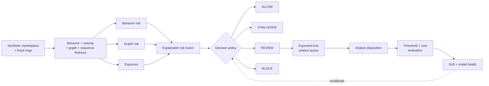

<div align="center">

# 🛡️ RiskOS

### Real-Time Trust & Safety Decisioning Lab

[](https://www.python.org/)
[](https://github.com/VinayK88/riskos/actions/workflows/ci.yml)
[](dashboard/app.py)
[](#safety-and-scope)

**Simulate → score → rank → decide → monitor → learn**

</div>

---

RiskOS is a reproducible marketplace trust-and-safety system that answers a harder question than **“is this fraud?”**:

> **Given model uncertainty, financial exposure, customer-friction cost, and finite analyst capacity, which entities should be allowed, challenged, reviewed, or blocked?**

The project combines behavioral risk, graph-style relationship signals, suspicious action sequences, exposure-aware prioritization, operating-policy decisions, threshold economics, and drift monitoring. The baseline uses only the Python standard library; Streamlit and pandas are optional for the interactive dashboard.

## Why this project is different

Most portfolio fraud projects stop after reporting AUC or accuracy. RiskOS models the rest of the production decision loop:

- overlapping benign and fraud populations instead of perfectly separable toy labels;
- behavioral + graph + temporal signals rather than a single static classifier;
- expected-loss prioritization so analyst attention follows risk *and* exposure;
- **ALLOW / CHALLENGE / REVIEW / BLOCK** policy outcomes;
- precision, recall, F1, false-positive cost, missed-loss cost, and review cost;
- hard analyst-capacity constraints when selecting the recommended threshold;
- PSI-based prediction drift monitoring with stable/watch/investigate states;
- deterministic synthetic fixtures, checked-in evaluation output, unit tests, and CI.

## Architecture



## Synthetic marketplace scenario

Each entity resembles a carrier or marketplace participant. Risk signals include:

| Signal family | Examples |
| --- | --- |
| Identity | new device, young account |
| Account change | bank-account change within 24h |
| Velocity | posting/activity rate vs. behavioral baseline |
| Relationship graph | shared devices, links to suspended entities, synthetic fraud-ring membership |
| Temporal sequence | suspicious multi-action sequence |
| Business exposure | dollars at risk if the entity is fraudulent |

Fraud is intentionally **not** perfectly obvious. Some synthetic fraud is stealthy, while legitimate entities can have risky-looking events such as a bank change, shared device, or temporary velocity spike. This creates the precision/recall and customer-friction tradeoff that a real decision system has to manage.

## Decisioning

RiskOS fuses behavior, graph, and exposure signals into an inspectable score, then maps it to an operational action:

```text
low risk                         → ALLOW
moderate risk + high exposure    → CHALLENGE
high risk                        → REVIEW
critical risk                    → BLOCK
```

Every scored entity also receives reason codes such as:

```text
linked_to_suspended_entities
shared_device_cluster
bank_change_24h
velocity_spike
new_device
suspicious_action_sequence
```

## Analyst queue: probability is not enough

RiskOS prioritizes review using expected loss:

```text
expected_loss = risk_probability × financial_exposure
```

That means a 72% risk entity with $100,000 exposure can outrank a 99% risk entity with only $50 at stake. This demonstrates the difference between **model ranking** and **business prioritization**.

## Threshold economics

For every candidate threshold, RiskOS calculates:

```text
expected operating cost =
    missed fraud loss
  + false-positive / customer-friction cost
  + analyst review cost
  + queue-overflow penalty
```

The recommended threshold is the minimum-cost option that also satisfies the configured **hard analyst review-capacity constraint**.

### Checked-in deterministic baseline

The committed fixture contains 600 synthetic entities using seed `17`. Under the illustrative operating assumptions in [`reports/baseline-evaluation.json`](reports/baseline-evaluation.json):

| Metric | Result |
| --- | ---: |
| Synthetic entities | 600 |
| Synthetic fraud cases | 75 |
| Synthetic fraud-ring members | 47 |
| Analyst review capacity | 60 |
| Recommended threshold | **0.35** |
| Precision | **94.5%** |
| Recall | **69.3%** |
| F1 | **80.0%** |
| Review volume | **55 / 60** |
| False positives | **3** |

These numbers validate reproducibility and the evaluation path. They do **not** estimate real marketplace fraud performance.

## Drift monitoring

`riskos/monitoring.py` implements a lightweight Population Stability Index (PSI) monitor over prediction scores.

```text
PSI < 0.10        stable
0.10 ≤ PSI < 0.25 watch
PSI ≥ 0.25        investigate
```

The dashboard also surfaces mean-score shift and the current high-risk population rate. A production implementation would extend this to feature drift, calibration, label delay, analyst-overturn rate, subgroup performance, and data-quality checks.

## Interactive dashboard

Install only the optional UI dependencies:

```bash
python -m pip install -r requirements-dashboard.txt
streamlit run dashboard/app.py
```

The dashboard provides three operational views:

1. **Decision queue** — exposure-aware ranked entities with actions and reason codes.
2. **Threshold economics** — precision/recall/F1, review volume, and expected operating cost by threshold.
3. **Model monitoring** — reference-vs-shifted score distributions and PSI status.

## Dependency-free quick start

```bash
python -m riskos.demo
python -m riskos.evaluation
python -m unittest discover -s tests -v
```

The core simulator, risk engine, decision logic, evaluation, and monitoring utilities require no third-party packages.

## Project map

```text
riskos/
├── README.md
├── pyproject.toml
├── requirements-dashboard.txt
├── dashboard/
│   └── app.py
├── reports/
│   └── baseline-evaluation.json
├── riskos/
│   ├── __init__.py
│   ├── core.py
│   ├── demo.py
│   ├── simulator.py
│   ├── evaluation.py
│   └── monitoring.py
├── tests/
│   ├── test_core.py
│   └── test_science.py
└── .github/workflows/ci.yml
```

## Production evolution

A production version would replace synthetic fixtures with privacy-reviewed marketplace event streams and add:

- online/offline feature consistency;
- event-time windows and streaming velocity features;
- a real entity graph store;
- calibrated supervised models and anomaly models;
- champion/challenger and shadow deployment;
- delayed-label and analyst-feedback handling;
- policy versioning and audit trails;
- fairness / subgroup guardrails;
- incident rollback and threshold kill switches;
- service-level latency and throughput monitoring.

## Safety and scope

All identities, labels, graph relationships, exposures, and cost assumptions are synthetic. RiskOS does not connect to real marketplace accounts, payments, bank data, customer records, or enforcement systems. It is a defensive trust-and-safety research and portfolio project, not a production fraud system.
